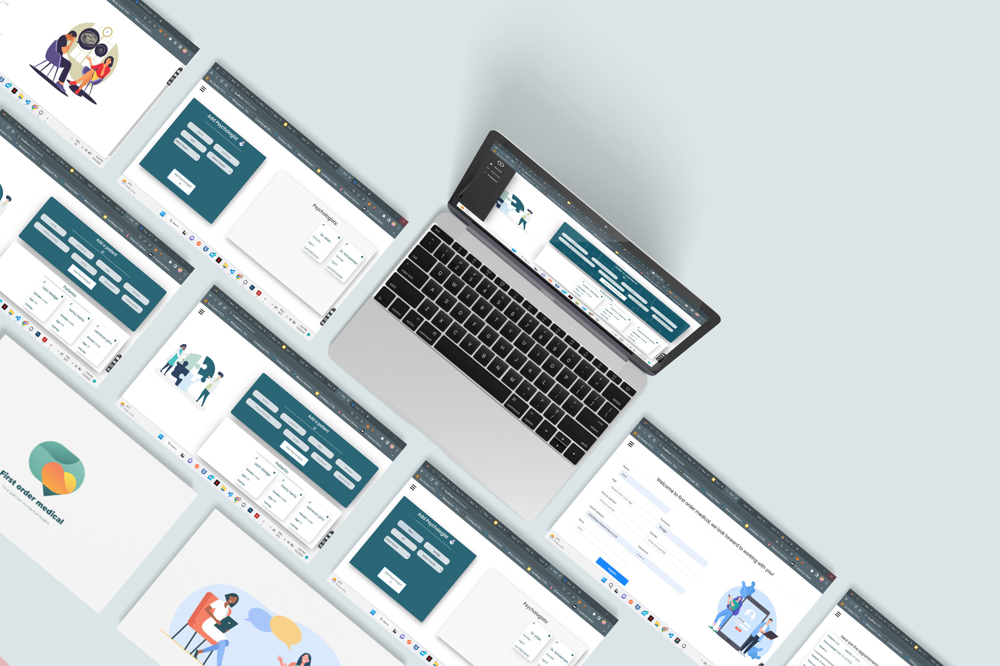

Repository Information & Links
 

<!-- HEADER SECTION -->
<h5 align="center" style="padding:0;margin:0;">Liam Wedge</h5>
<h5 align="center" style="padding:0;margin:0;">21100218</h5>
<h6 align="center">DV200 - Term 2 Project | 2022</h6>
 

    

<!-- TABLE OF CONTENTS -->

## Table of Contents

- The project has been developed using MSQL, PHP and ReactJS for the frontend. It servers as a management portal and allows the head receptionist the ability to add and remove doctors and patients where they deem necessary.

- [Getting Started](#getting-started)
  - [Prerequisites](#prerequisites)
  - [How to install](#how-to-install)
- [Features and Functionality](#features-and-functionality)
- [Concept Process](#concept-process)
  - [Ideation](#ideation)
  - [Wireframes](#wireframes)
  - [Custom UI](#user-flow)
- [Development Process](#development-process)

  - [Future Implementation](#peer-reviews)

- [Final Outcome](#final-outcome)
  - [Mockups](#mockups)
  - [Video Demonstration](#video-demonstration)
- [Conclusion](#conclusion)
- [License](#license)
- [Contact](21100218@virtualwindow.co.za)
- [Acknowledgements](#acknowledgements)

<!-- header image of project -->

### Project Description

First order medical is an app designed for maintaining and organizing a psychologists practice, receptionists and control and run the site by conducting certain CRUD functionality such as adding appointments, doctors, patients etc

### Built With

- [React](https://reactjs.org/)
- [MYSQL](https://dev.mysql.com/doc/)
- [PHP](https://www.php.net/docs.php)

<!-- GETTING STARTED -->
<!-- Make sure to add appropriate information about what pre requesite technologies the user would need and also the steps to install your project on their own machines -->

## Features and Functionality

### Feature 2

The landing page where receptionists can add appointments and assign doctors to those appointments in question.

 

<!-- VIDEO DEMONSTRATION -->

### Video Demonstration

To see a run through of the application, please click below:

[View Demonstration](https://drive.google.com/drive/folders/1bHFGq7nIGPdDqJGrCNNCiSqTUyPk-h7F)

See the [open issues](https://github.com/NoSleepTillLambos/FirstOrderMedical/issues) for a list of proposed features (and known issues).

<!-- AUTHORS -->

## Authors

- [LiamWedge](https://github.com/NoSleepTillLambos)

<!-- LICENSE -->

## Contact

- **Liam Wedge** - [Liamwedge00@gmail.com]
- **Project Link** - https://github.com/NoSleepTillLambos/FirstOrderMedical

<!-- ACKNOWLEDGEMENTS -->

## Acknowledgements

<!-- all resources that you used and Acknowledgements here -->

- [PHP](https://www.php.net/)
- [mySQL](https://www.mysql.com/)
- [React](https://reactjs.org/)
